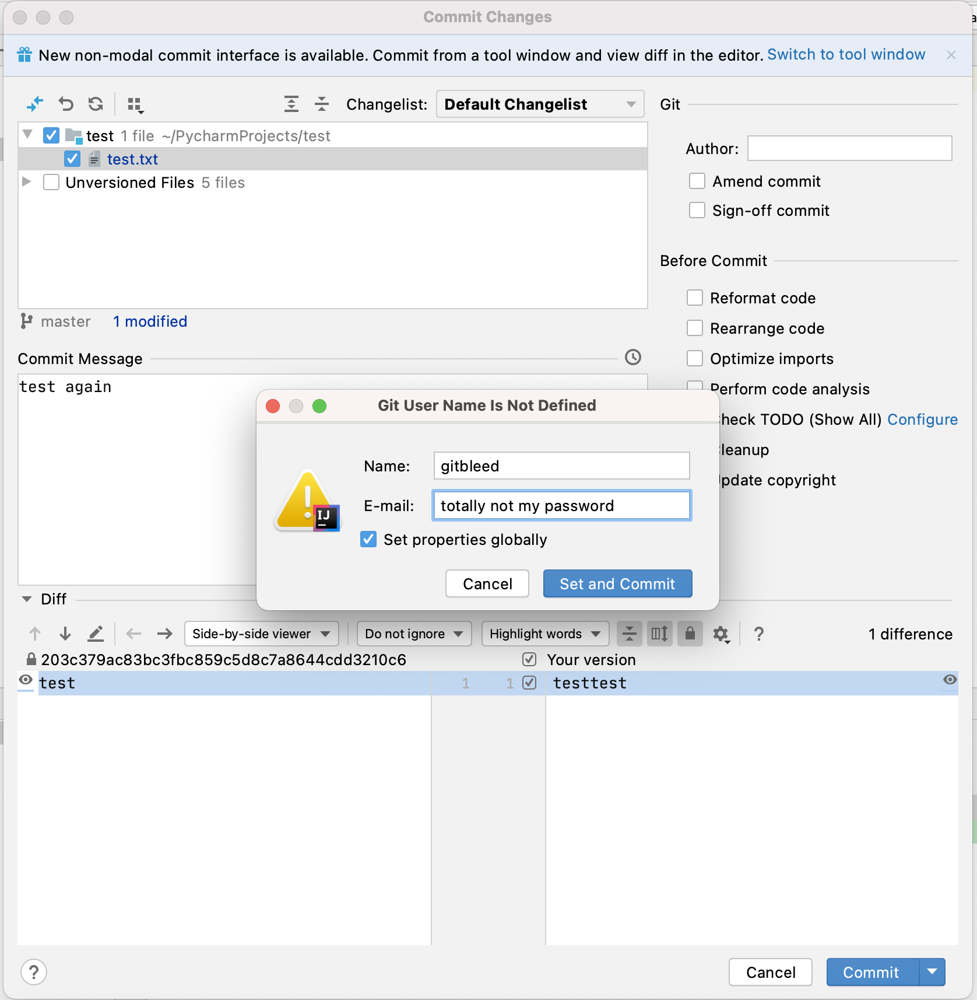

# TL;DR 
Due to configuration errors or human error, significant numbers of people may have accidentally checked GitHub credentials 
into GitHub commits as metadata, most commonly a username as the author name and a password in the email address field.
We estimate in the region of 50,000 to 100,000[^1] user credentials may have been affected covering a wide range of 
organisations including governments, corporations, large open-source foundations as well as smaller organisations and 
individuals. 

GitHub have since rolled out changes that auto revoke PAT tokens and GitHub credentials if they are detected in commit metadata and have performed the task retroactively so any developer on GitHub.com who may have been affected in the past should have received an email already.

While GitHub has a form of MFA known as 'Verified Device' [https://github.blog/changelog/2019-07-01-verified-devices/], many users still choose to re-use the same password across multiple services so it's important to check if you have accidentally committed any credential and what the risks are related to your account and any organisation you are connected to.

As there are still leaked credentials associated with this issue in GitHub and other datastores we've chosen not to disclose any
specific details about affected organisations or repos at this time. 


# How did we find the issue
We were first alerted to this form of credential leak by a developer who had accidentally committed their username as 
their committer name and their password as their committer email address. Interested by this, we manually analysed 
several internal repos for this particular client and found that this had happened before a number of times over 
the years, possibly without the users ever knowing they had done this.

A simple way to find this is with
``` git log |grep Author |grep -v @ ```

Offering to perform the same task against this client's public repos, we found a few instances, including a functional 
PAT token that would have allowed us to write to at least some of the repos belonging to the client.

Automating the scanning process and choosing some large public organisations, we discovered that while it was a rare 
event, it was happening and had been happening for many years without many developers realising. With the huge numbers
of commits on GitHub even comparatively rare events occur a significant number of times. The implications were 
terrifying. Many open-source projects may have been disclosing developer credentials in clear text in the very 
metadata of their projects.

# Root cause
When the developer first spoke to us, they explained that they were setting up an IDE on their machine and that 
through setting up a new project, they were prompted for a git author name and email address. However due to muscle memory and seeing a prompt similar to a login screen, they entered their credentials which were saved as commit metadata every time they committed to any repo. 

The following screenshot shows as an example what Intellij looks like when you attempt to commit to a repo with no configured author details. Anything you enter here will be saved in a location such as `~/.gitconfig` and the contents committed to git any time there is a `git push` on this device.



There could be other reasons for this, including bugs in automation scripts and possibly a misunderstanding of the git CLI. 
However, as well as passwords we found lots of other bits of information such as left-over command line parameters and 
even extensive internal LDAP group information.


# How to see if you are affected
All our research was focused on GitHub, both GitHub enterprise (on-prem) and GitHub.com as that is the tooling used 
by our clients. However, it is possible that other code repository systems are also affected by this or a similar issue. 

In a future blog post we'll go into more details of the scripts we used to investigate this issue, along with some other external 
sources of data that also leaked GitHub credential information. 

In this post we'll summarise a couple of simple ways to look for secrets in GitHub commit data. 

## Check Git Config
If you think you may have been affected, checking your git config is the first step that I would recommend, as it would show you the contents of the author email address being automatically used on each commit.

## Git Log
This method is perhaps the least automated but also the simplest. Clone a repo that you have pushed to, navigate to that directory and run `git log| grep Author | grep -v @`.
This method is not fool proof however and anyone who has an @ sign in their password would need to perform an enhanced version of this grep as it would otherwise be removed from the results.

## GitHub Search
You can use the GitHub Advanced Search interface 'GitHub Searching Commits'[https://docs.github.com/en/search-github/searching-on-github/searching-commits] to search commit metadata, for example using ```committer-email```, the most common place we found passwords. It was easy to identify users who had committed well-known common passwords. However, while this does work it would also potentially expose any password you are searching for in browser history and web logs etc and should only really be used for research purposes.


It's also easy to use the GitHub search API, which at the time (August/September 2021) was in preview. We used it to return the number of commits 
with a string matching a common password set as the committer email address. 

```python
def search_api(password: str) -> int:
    url = 'https://api.github.com/search/commits?q=committer-email:' + password
    headers = {
        'Authorization': 'token' + token,
        'Accept': 'application/vnd.github.cloak-preview'
    }
    r = requests.get(url, headers=headers)
    if r.status_code != 200:
        print(f"Error - HTTP Status Code: {r.status_code}")
        print(r.text)
        return -1
    else:
        result = r.json()
        return result['total_count']

```

Whilst GitHub have implemented a number of mitigations it is still possible to find examples of secrets in commit metadata.

It should also be possible to use the user events API to view all of your personal commit data too however the GitHub documentation suggests you may be limited in the number of events and the timelines for which you can search [https://docs.github.com/en/rest/reference/activity#events]

# Recommendations
## For GitHub Users
* Review IDE and Git configuration files for mis-configurations - see [Check Git Config](#check-git-config)
* Review automation scripts that interact with Git
* Check metadata for any:
   - non-GitHub repositories you use
   - private repos on GitHub.com
   - repos in self-hosted GitHub Enterprise
* If you find misconfigurations during the above steps consider incident response approach. This is likely to be challenging as we have identified issues going back at least 10 years. We would recommend seeking IR expert advice if you have been affected. 
* If you use self hosted Git Enterprise - Roll your own credentials as these are not controlled by Git
* If you find leaked secrets in private repo metadata, roll these yourself as these are not automatically changed by GitHub.
* You should also rotate any credentials on any other systems where they may have been reused. 
* Enable MFA (Multi-Factor Authentication / also sometimes called Two Step Verification) everywhere it's supported. 
* Link to relevant NCSC Advice - 
   - https://www.ncsc.gov.uk/collection/developers-collection/principles/protect-your-code-repository
   - https://www.ncsc.gov.uk/collection/passwords/updating-your-approach 

## For Git clients and IDEs
* Apply input validation to fields, especially the email field and display warnings to users if the data doesn't match the expected format.

# Other Considerations
## Software Supply Chain
We found leaked credentials in a number of very popular open-source projects. We scanned all the repos in a sample of 70 open-source 
organisations used by one our clients and in approximately half of them found strings which looked like plausible passwords, as well as some PATs. 
These in theory could have been used to make unauthorised changes to these projects. 
 

## External Authentication Providers
For organisations using an external identity provider, e.g., via SAML, GitHub should have no knowledge of the actual credentials. Therefore, the automated security checking implemented by GitHub to prevent users from accidentally leaking credentials in commit data may not detect these.

## Cross domain commits
Users may commit across a range of domains, including to on-prem hosted GitHub Enterprise, GitHub.com and to repos in multiple organisations. This has a number
of implications for detecting and remediating leaked credentials including:
* Users of on-prem GitHub enterprise who've accidentally included credentials in their git config may leak internal authentication credentials if they also push
  to external repos. As stated above, GitHub will not be aware of these credentials and has no ability to revoke them or alert users.
* Credentials found in one organisations public repos may be valid against a number of different repos if the user has access, e.g., as a collaborator. This 
can make investigating the scope of compromise for GitHub credentials more difficult.


# Timeline Overview
Whilst GitHub started to deploy some remediation in September 2021 there were, and potentially still are, risks associated with credential reuse for exposed credentials. We felt that on the balance of risk is was better to wait to publish any details until 
GitHub had completed the majority of their remediation work.

* July 2021 - Found fist instance on GitHub Enterprise server when a developer asked 'How do I change my password'
* 12th August 20201 - Contacted GitHub via HackerOne
* 16th August 2021 - HackerOne closed issue
* 27th August 2021  - Escalated to clients GitHub Account Manager
* 2nd September 2021 - Started discussions with GitHub Security Team
* 7th September 2021 - Sought advice from NCSC Vulnerability team due to widespread nature of the issue 
* 17th September 2020 GitHub started:
  - Scanning the commit metadata (author_email, author_name, committer_email, committer_name and message) as well as the rest of the  
commit for GitHub tokens and  automatically revoking the token and notifying the owner. 
* 22nd October 2021 GitHub confirmed they implemented: 
  - Scanning of all historic commit metadata for PATs when a repo is transitioned from private to public and revoking any  found
* 1st November 2021 - GitHub started: 
   - Scanning pull request, issue descriptions and comments for GitHub PATs, and automatically revoking any found
* 8th March 2022 GitHub confirmed they:
  - Rolled out an auto-revoke flow for logins/passwords in new commit metadata including usernames / passwords as names or email metadata.
  - Started contacting members of the GitHub secret scanning partner program to let them know they plan to start sending them results found in commit 
metadata and issues / comments. GitHub acknowledged this will take a while to roll out, since it requires partners to start parsing updated 
details in the webhooks when sending them discovered credentials.
* 23rd March 2022 - GitHub contacted us to start the process of co-ordinated disclosure as they plan to publish a change log for the soon to be released Secret Scanning for credentials feature.  


# Future posts 

We plan to release more details in the coming weeks which will include:

* An overview of the automated scanner and the evolution of this tooling
* Other Data sources we found that leaked secret data from GitHub commit metadata
* Sample testing against the ';--have i been pwned?[^2] dataset
* Overview of bug reporting process, including interaction with HackerOne[^3]
* Some stats


# Researchers
This research was lead by Aaron Devaney (MDSec) supported by Will Deane (ASX Consulting Ltd). 

As with all research other people
contributed advice and guidance along the way including, but not limited to:
* UK’s National Cyber Security Centre (NCSC)
* Marcus Pinto (MDSec)
* Carolos Foscolos - who provided the GitBleed[^4] Logo as well as advice

# Name
When we first started researching this issue (July/August 2021) Carolos Foscolos came up with the name GitBleed, he also created a logo and registered ```gitbleed.com```. 
We also then registered gitbleed as a github handle, gitbleed@gmail.com and @gitbleed on twitter. We've been holding off publishing details to allow GitHub
time to implement mitigations. 

In the meantime, other researchers found an issue with 
 information leaking from a GitHub repo when using the ```--mirror``` switch with ```git clone``` 
[https://wwws.nightwatchcybersecurity.com/2022/02/11/gitbleed/] and named it GitBleed. As naming things is one of the two hard problems in computer science[^5] 
and the issue we've been researching is no longer 'GitBleed', we've gone with NotGitBleed. 

# Footnotes
[^1]: 50,000 to 100,000 figure is based on extrapolating data obtained for all commits within a range of fixed periods as we didn't have the time or resources to search every commit in GitHubs history.  

[^2]: https://haveibeenpwned.com

[^3]: https://www.hackerone.com

[^4]: The name was selected because although it is not the same level of concern as things like heartbleed the potential to backdoor third party dependencies was serious enough that we wanted a catchy name.

[^5]: https://lmgtfy.app/?q=there+are+only+two+hard+things+in+computer+science
